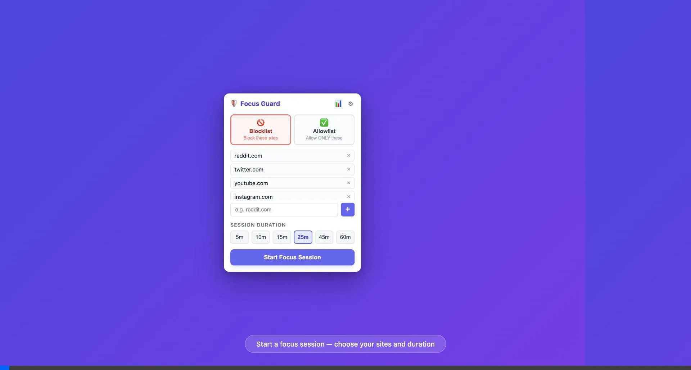
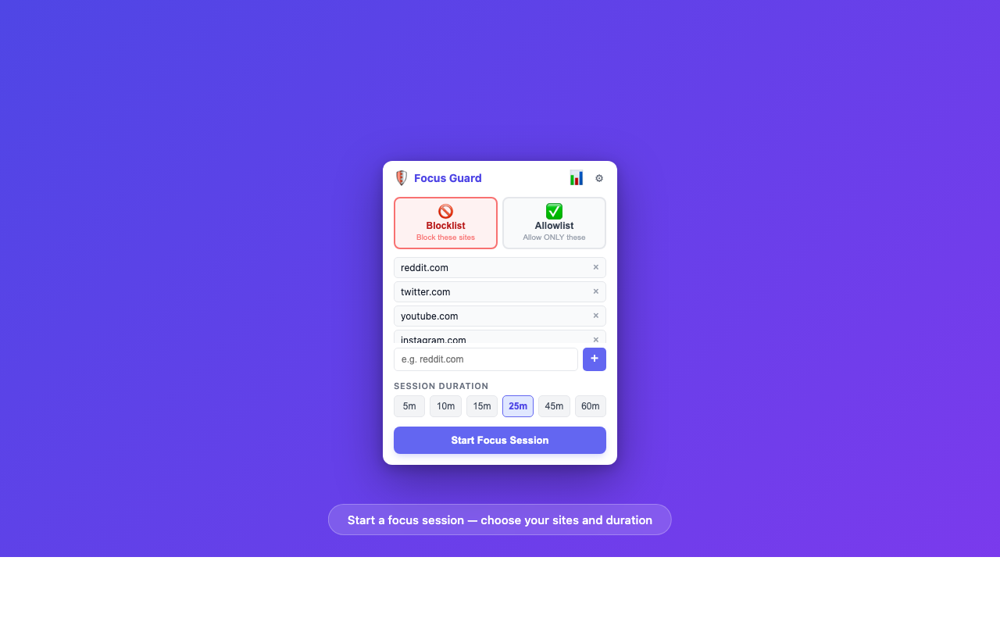
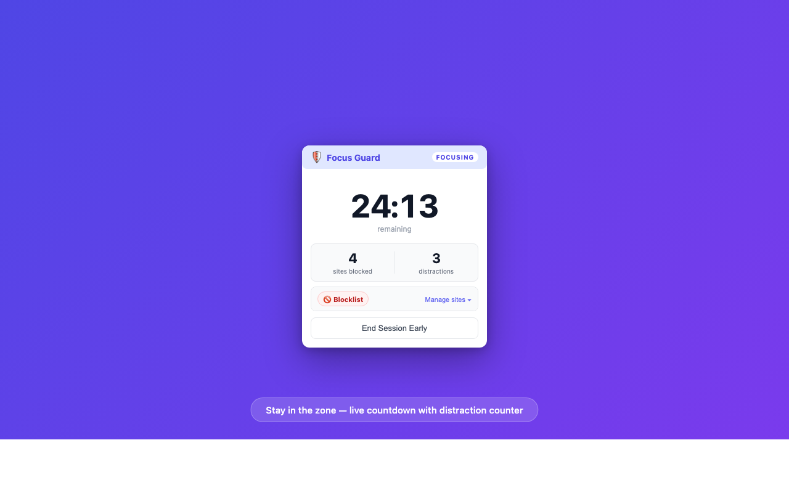
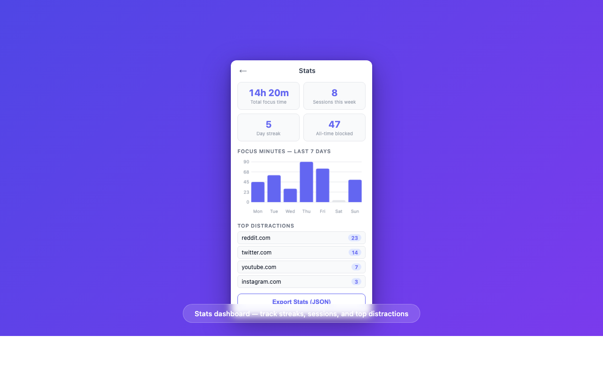
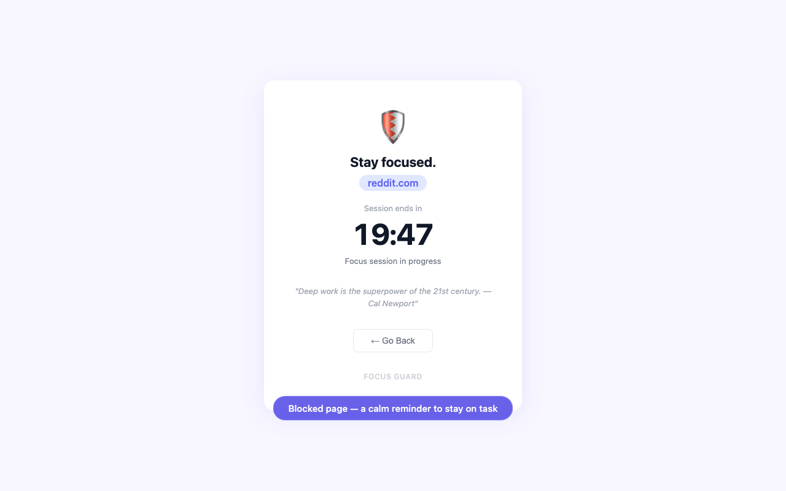

# 🛡️ Focus Guard

**Take back your focus. Block the sites that steal your time.**

Focus Guard is a privacy-first Chrome extension designed to help you break bad digital habits, stop infinite scrolling, and enter a state of deep work. It works by restricting access to your biggest distractions during designated output sessions, forcing you to stay engaged with what actually matters.

## 📸 Interface Preview

  

 

  
  

  
  

## ✨ Why Focus Guard?

Instead of just passively tracking where your time goes, Focus Guard actively intervenes to protect your attention span.

- **🚫 Block The Noise (Blocklist Mode):** Add your personal productivity-killers (Reddit, Twitter, News). Try to visit them during a session, and you'll immediately hit a calm, mindful intervention page.
- **✅ Curate Your Internet (Allowlist Mode):** Need to do deep research? Block the *entire internet* except for the 2-3 specific websites you actually need to do your job.
- **⏱️ Commit to Deep Work (Timed Sessions):** Lock in for 15, 30, or 60 minutes. A looming countdown timer keeps you honest and adds positive pressure to produce output.
- **📊 Build Bulletproof Habits (Stats & Streaks):** We track your daily streaks, total focus hours, and visually expose your top 10 most distracting websites so you know exactly which habits to break.
- **⏰ Zero-Friction Routines (Schedule Mode):** Automate your discipline. Set Focus Guard to automatically lock down your browser at 9:00 AM every single weekday.
- **🔒 100% Private By Design:** Everything is processed securely on your device using `chrome.storage.local`. No cloud syncing, no data harvesting, no analytics platforms. Your habits are your business.

## 💳 Simple, Honest Pricing

Protecting your attention shouldn't require a compromise.

- **Free Tier:** Start building better habits today. The free tier gives you up to **3 daily focus sessions**—perfect for carving out a few hours of deep work every afternoon.
- **Pro Tier:** Ready to completely overhaul your workflow? Upgrade for **unlimited daily sessions** and advanced configuration.

## 📂 Repository Contents

| Folder/File | Description |
|-------------|-------------|
| `extension/` | Full extension source code — load this folder in Chrome via 'Load unpacked' |
| `promo/` | Promotional graphics and banners for the Chrome Web Store |
| `screenshots/` | High-res screenshots of the extension dashboard and block pages |
| `store_listing.md` | Copy and metadata used for Chrome Web Store publishing |

## 🚀 Install Locally (Developer Mode)

1. Clone this repository to your local machine.
2. Open Google Chrome and navigate to `chrome://extensions`.
3. Toggle **Developer mode** on in the top-right corner.
4. Click the **Load unpacked** button.
5. Select the `extension/` directory from this repository.
6. Pin the Focus Guard icon to your toolbar and start focusing!

## 📄 Privacy Policy

Hosted at: `https://kibrom1.github.io/focus_guard/`

## ⚖️ License

MIT License
